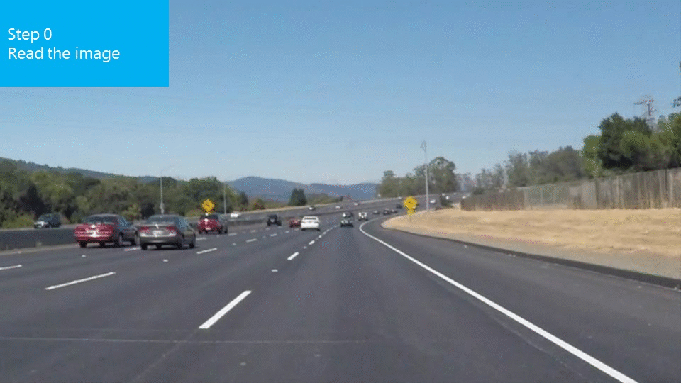

# **Finding Lane Lines on the Road** 

Overview
---

When we drive, we use our eyes to decide where to go.  The lines on the road that show us where the lanes are act as our constant reference for where to steer the vehicle.  Naturally, one of the first things we would like to do in developing a self-driving car is to automatically detect lane lines using an algorithm.

This project uses Python and OpenCV(Open-Source Computer Vision)

In Hough Line Transform
'max_line_gap' defined the maximum distance between segments that will be connected to a single line
'min_line_len' defined the minimum length of a line that will be created
Increasing these parameters will create smoother and longer lines

"threshold" defined the minimum number of intersections in a given grid cell that are required to choose a line.
Increasing this parameter, the filter will choose longer lines and ignore short lines.
http://docs.opencv.org/3.0-beta/doc/py_tutorials/py_imgproc/py_houghlines/py_houghlines.html